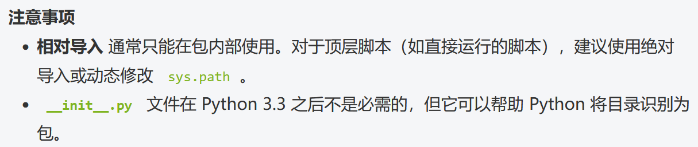
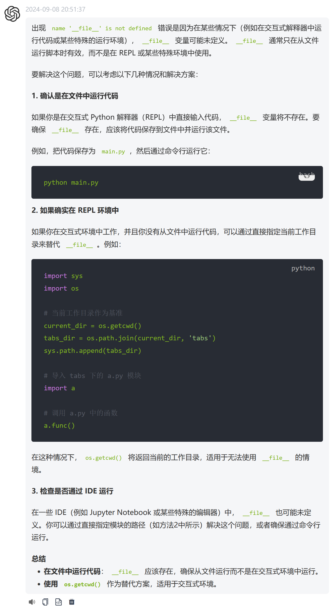
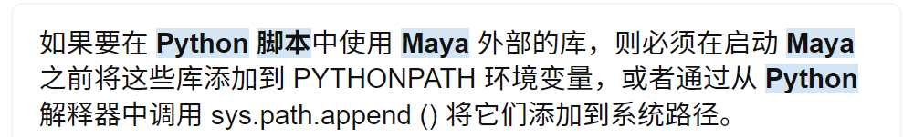
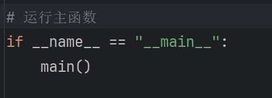
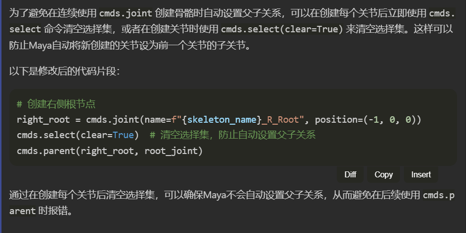
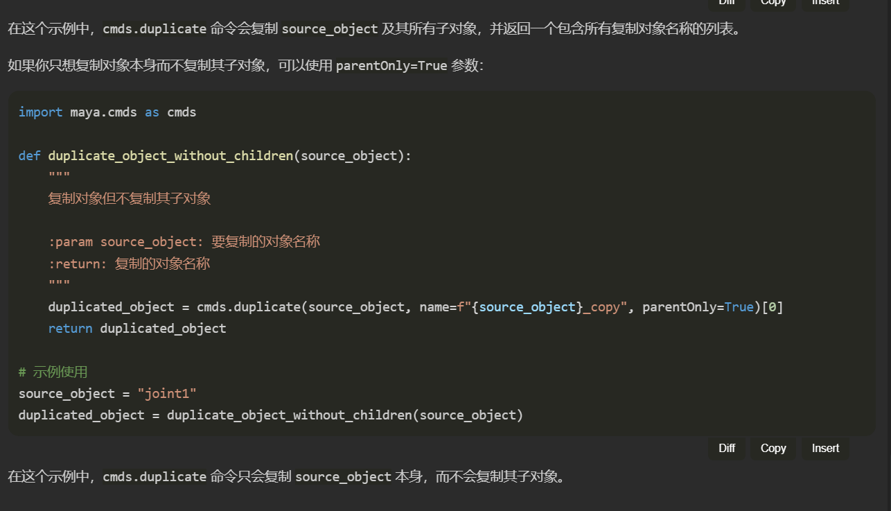

把这条删掉会导致界面不打开

递归命名子对象要从儿子先命名，否则命名了父亲会导致子对象无法找到

AI很难理解的一点是MAYA中后创建的骨骼默认是前者的子骨骼
重复设置父子关系会导致报错

复制的时候也会复制父亲节点这一属性，真的是全属性

骨骼设置旋转确实是很蠢的，尽量让所有骨骼的旋转不动，让它的轴向指向父节点

def create_symmetric这个函数很好地帮我解决了cmds.listRelatives这个函数会出错的问题，多参考

骨骼出问题的原因就是父骨骼对子骨骼的影响，子骨骼先被设置，父骨骼移动的时候是一个刚体，子骨骼就不知道被移到哪里去了