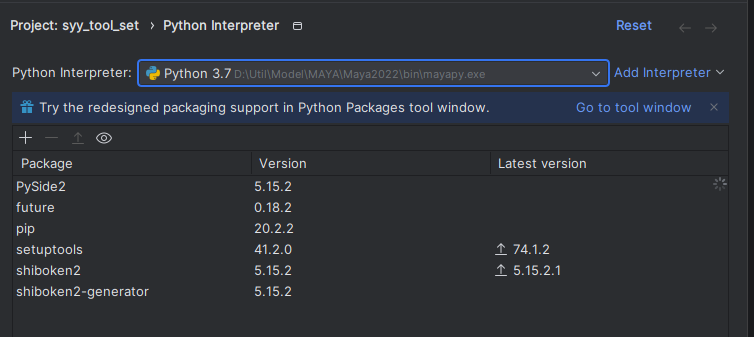
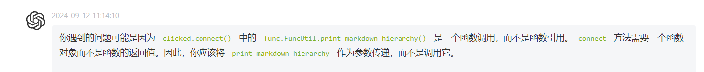
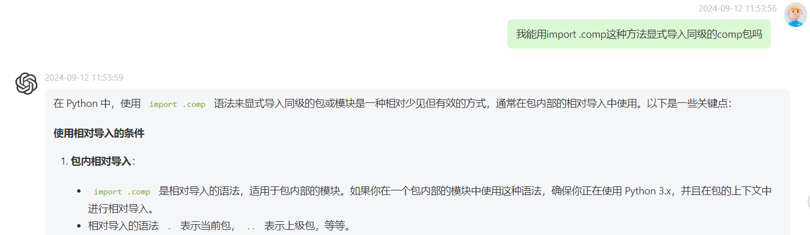
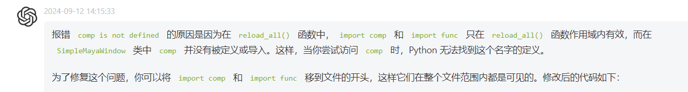
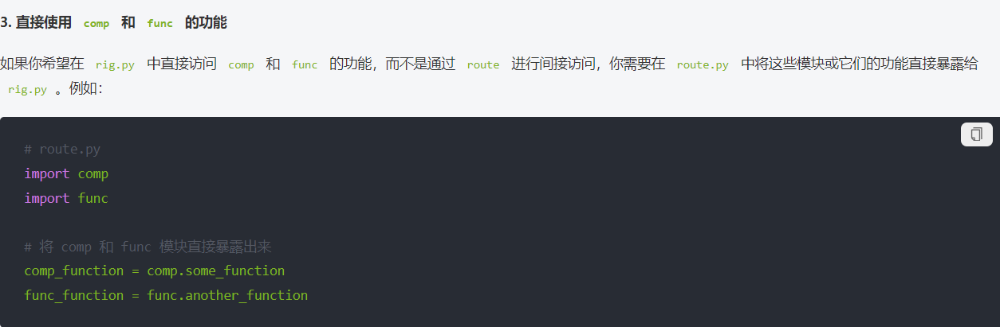
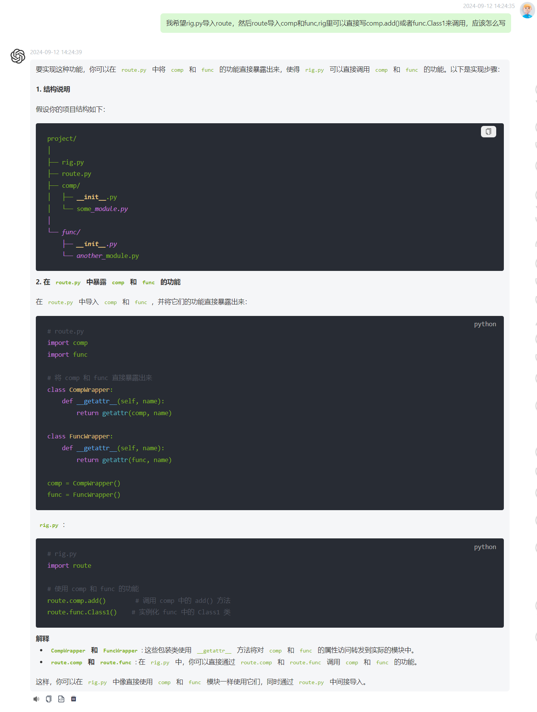

# 一 python回顾
### 1

### 2

### 3

### 4

把这条删掉会导致界面不打开

# 二 架构和开发要点
### 1
递归命名子对象要从儿子先命名，否则命名了父亲会导致子对象无法找到

### 2 maya2022稳定打开接口的脚本：
import maya
import maya.cmds as cmds

def pycharmConnect(standalone=False):
    
	if not cmds.commandPort(':4434', query=True):
	    cmds.commandPort(name=':4434')

maya.utils.executeDeferred(pycharmConnect, standalone=True)

# 三 maya.cmds

### 6

### 7
MAYA中后创建的骨骼默认是前者的子骨骼,需要取消选择才会阻止这个自动父子关系
重复设置父子关系会导致报错

### 8

### 9
duplicate对象的时候也会复制其父亲节点是谁这一属性，真的是全属性

# 四 实践反馈

### 10
骨骼设置rotation不通过joint设置orientation确实是很蠢的，尽量让所有骨骼的旋转不动，让它的轴向指向父节点

### 12
骨骼出问题的原因就是父骨骼对子骨骼的影响，子骨骼先被设置，父骨骼移动的时候是一个刚体，子骨骼就不知道被移到哪里去了

### 13
下完maya建议看看对应的mayapy自带的包列表，你就知道它想让你如何开发

#五 QT

### 14

### 15

记得打开报错栈确实很重要
https://github.com/cmcpasserby/MayaCharm/issues/40

import作用域

路由脚本需要暴露出导入的包的使用

路由导入还需要包装类，并不简单，还是不建议用了
